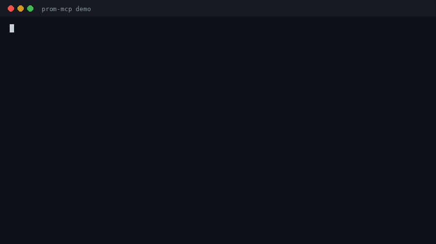
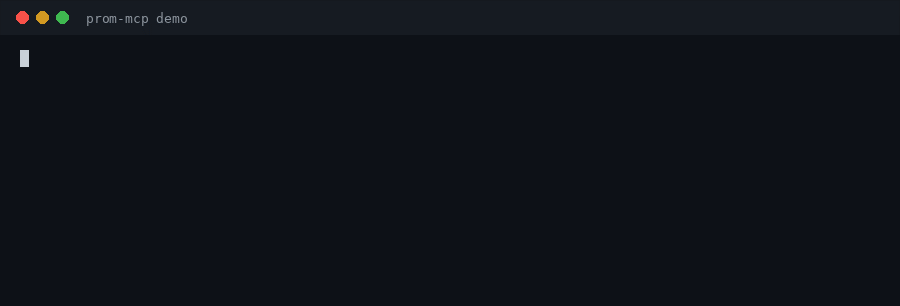
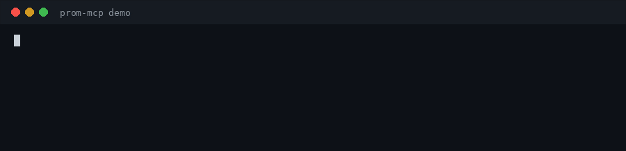

# prom-mcp — Prometheus MCP Server for AI Agents (Claude Code, Cursor)

[](https://github.com/aniketatgithub/prom-mcp/actions/workflows/ci.yml)
[](https://go.dev)
[](LICENSE)
[](https://registry.modelcontextprotocol.io/v0.1/servers?search=prom-mcp)

**prom-mcp is a Prometheus MCP server (Model Context Protocol) that gives AI agents production-grade eyes on your metrics.** Connect Claude Code, Cursor, or any MCP client to Prometheus and let the agent run PromQL queries, explain firing alerts with their rule definitions, and discover which series actually exist before querying — so it investigates instead of guessing.

Built by a production engineer who works on-call, so the output reads like a triage note, not a raw JSON dump.

**5 tools • 2 resources • 1 triage prompt • single Go binary • zero dependencies • stdio**



## Install

### Claude Desktop (MCPB, no toolchain needed)

Download the bundle for your platform, then open it or drag it into Claude Desktop (Settings → Extensions). You will be asked for your Prometheus URL, which defaults to `http://localhost:9090`.

| Platform | MCPB bundle |
| --- | --- |
| macOS (Apple silicon) | [prom-mcp_v0.2.0_darwin_arm64.mcpb](https://github.com/aniketatgithub/prom-mcp/releases/download/v0.2.0/prom-mcp_v0.2.0_darwin_arm64.mcpb) |
| macOS (Intel) | [prom-mcp_v0.2.0_darwin_amd64.mcpb](https://github.com/aniketatgithub/prom-mcp/releases/download/v0.2.0/prom-mcp_v0.2.0_darwin_amd64.mcpb) |
| Linux (x86_64) | [prom-mcp_v0.2.0_linux_amd64.mcpb](https://github.com/aniketatgithub/prom-mcp/releases/download/v0.2.0/prom-mcp_v0.2.0_linux_amd64.mcpb) |
| Linux (arm64) | [prom-mcp_v0.2.0_linux_arm64.mcpb](https://github.com/aniketatgithub/prom-mcp/releases/download/v0.2.0/prom-mcp_v0.2.0_linux_arm64.mcpb) |

### Claude Code

With the binary on your `PATH` (release download or `go install`, see below):

```bash
claude mcp add prom -- prom-mcp
```

Set `PROM_URL` in your shell first if your Prometheus is not at `http://localhost:9090`, or pass `--env PROM_URL=...` to the command. More variants in [examples/claude-code.md](examples/claude-code.md).

### Cursor

Add to `~/.cursor/mcp.json` (same file as [examples/cursor-mcp.json](examples/cursor-mcp.json)):

```json
{
  "mcpServers": {
    "prom": {
      "command": "prom-mcp",
      "env": {
        "PROM_URL": "http://localhost:9090"
      }
    }
  }
}
```

### VS Code

Add to `.vscode/mcp.json` (same file as [examples/vscode-mcp.json](examples/vscode-mcp.json)):

```json
{
  "servers": {
    "prom": {
      "command": "prom-mcp",
      "env": {
        "PROM_URL": "http://localhost:9090"
      }
    }
  }
}
```

### Go install / build from source

```bash
go install github.com/aniketatgithub/prom-mcp@latest
```

```bash
git clone https://github.com/aniketatgithub/prom-mcp && cd prom-mcp
go build -o prom-mcp ./cmd/prom-mcp
```

Plain binaries for all four platforms are also on the [v0.2.0 release](https://github.com/aniketatgithub/prom-mcp/releases/tag/v0.2.0), next to the MCPB bundles above.

## What to ask

| You ask | prom-mcp does |
| --- | --- |
| "Why is NodeDown firing?" | `prom_alerts_explain` returns the active alert joined with its rule expression, group, `for`, labels, and annotations. |
| "What jobs and instances actually exist?" | `prom_series_discover` and `prom_label_values` list real series and label values before any query is written. |
| "Is this getting worse?" | `prom_query_range` summarizes the window per series: points, first, last, min, max. |

## See it in action

**Alert triage: why is the node down?**


**Discover what exists before querying:**



**Check the trend: is node1 getting worse?**



## What it looks like

Ask your agent *"why is the node down?"* and the alert tool answers in triage shape:

```text
1 active alert(s)

[firing] NodeDown (since 2026-10-08T10:00:00Z, value 0)
  labels: {alertname="NodeDown", instance="node1:9100", job="node", severity="critical"}
  summary: Node node1:9100 is down
  description: Scrapes failing for 5m
  rule: up{job="node"} == 0
  group: node.rules
  for: 5m0s
```

Plus a built-in `triage` prompt template that walks the agent through alerts, discovery, and trend checks in order.

## Tools

| Tool | What it does |
| --- | --- |
| `prom_query` | Instant PromQL query, rendered as compact labelled series and values. |
| `prom_query_range` | Range query over the last N minutes; per-series points, first, last, min, max. |
| `prom_alerts_explain` | Active alerts joined with alerting-rule expressions, rule group, `for` duration, and annotations. |
| `prom_label_values` | Lists real values of a label (optionally scoped), so the agent learns actual job/instance names. |
| `prom_series_discover` | Checks which series exist for a label matcher, so the agent stops hallucinating metric names. |

Resources: `prometheus://alerts` (explained alerts), `prometheus://config`. Prompt: `triage`.

## Try it with no server

```bash
prom-mcp demo        # fixture-backed self-test: query, alert explanation, series discovery
prom-mcp query 'up'  # one-shot CLI query against $PROM_URL
```

## Configuration

| Setting | Env var | Config file key |
| --- | --- | --- |
| Prometheus base URL | `PROM_URL` | `base_url` |
| Bearer token (auth-protected Prometheus) | `PROM_TOKEN` | `token` |
| Request timeout | `PROM_TIMEOUT` (e.g. `30s`) | `timeout_seconds` |
| Config file path | `PROM_CONFIG` | |

Config file is JSON, looked up at `$PROM_CONFIG`, then `./prom-mcp.json`, then `~/.prom-mcp.json`:

```json
{ "base_url": "https://prometheus.example.com", "token": "…", "timeout_seconds": 30 }
```

Env vars override the file. No config at all defaults to `http://localhost:9090`.

## Why not just give the agent raw API access?

Agents drown in raw Prometheus JSON and invent metric names that do not exist. prom-mcp returns terse, labelled, triage-shaped text and makes the agent discover before querying. That is the difference between an agent that guesses and an agent that investigates.

Single Go binary, zero dependencies, works fully offline against your own Prometheus.

Comparing servers? See [docs/comparison.md](docs/comparison.md) for an honest side-by-side with pab1it0/prometheus-mcp-server and the Prometheus org's prometheus/prometheus-mcp.

## FAQ

**Which AI clients work with prom-mcp?**
Any MCP client: Claude Code, Cursor, Windsurf, Zed, and custom agents. It speaks newline-delimited JSON-RPC 2.0 over stdio.

**How do I connect prom-mcp to a remote Prometheus?**
Set `PROM_URL` to your Prometheus base URL (for example `http://localhost:9090` or your internal endpoint) when adding the server.

**Can an AI agent explain why a Prometheus alert is firing?**
Yes. `prom_alerts_explain` joins active alerts with the rule that fired them (expression, summary, description), so the agent can reason about the cause instead of reporting raw JSON.

**Does prom-mcp need any API keys or cloud services?**
No. It is a single local binary talking only to your Prometheus.

**How does prom-mcp compare to the other Prometheus MCP servers?**
See [docs/comparison.md](docs/comparison.md). Short version: prom-mcp is the focused alert-triage option with 5 tools; the others cover more of the Prometheus API or ship more deployment machinery.

**How is this different from exposing the Prometheus HTTP API to an agent?**
Raw API access returns nested JSON the agent must parse and invites invented metric names. prom-mcp renders compact labelled text, joins alerts with the rules that fired them, caps long outputs, and nudges discovery before querying. It also retries transient failures and supports bearer-token auth.

**Does it work with a remote or auth-protected Prometheus?**
Yes: set `PROM_URL` and `PROM_TOKEN` (or a JSON config file). See Configuration.

**Which Prometheus versions are supported?**
Any server exposing the standard HTTP API (`/api/v1/query`, `query_range`, `alerts`, `rules`, `series`, `label/<name>/values`).

## License

MIT. See [LICENSE](LICENSE).
